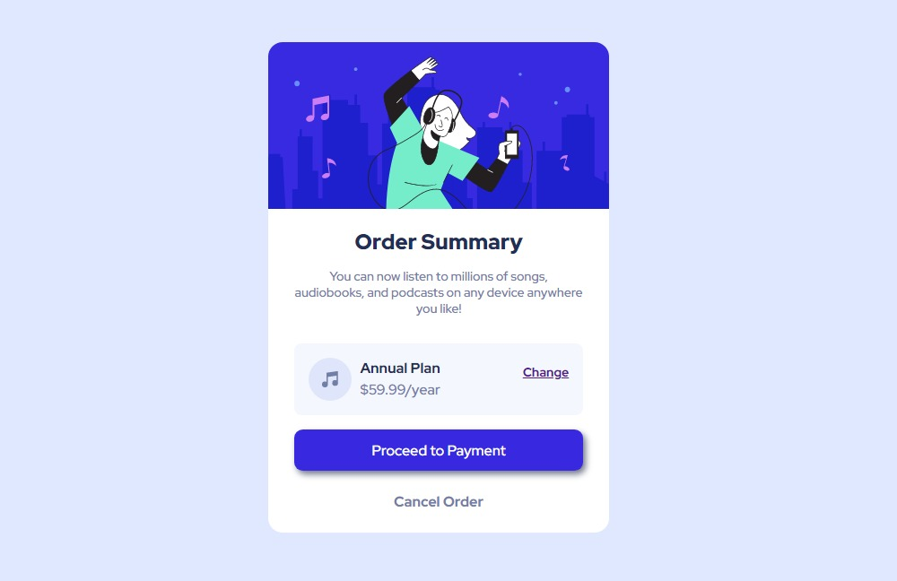

# Frontend Mentor - Order summary card

This is a Solution to the the  [  Order summary card  ](https://www.frontendmentor.io/challenges/order-summary-component-QlPmajDUj). Frontend Mentor challenges  helps to improve your coding  skills by building realistic projects.

## Table of contents

- [Designs](#designs)
- [Link](#links)
- [Built With](#built-with)
- [What I learned](#what-i-learned)
- [Author](#author)
- [About](#about)

### Links 

- Live Site URL : [ Order summary card ](https://ajaysinhaorigin.github.io/FrontendMentor--Challange/order-summary-component-main/)

### Designs 

  

### Built with 

- Semantic HTML5 markup  
- CSS custom properties  
- Grid

### What I learned 

- CSS Flex
- CSS Box-Shadow

### Author 

- Frontend Mentor  - [@ajaysinhaorigin](https://www.frontendmentor.io/profile/ajaysinhaorigin)

### About 

I was started to code just for Fun and now it Becomes my Passion. I am a Frontend Web-developer Working with ReactJS , Javascript , CSS , HTML .
