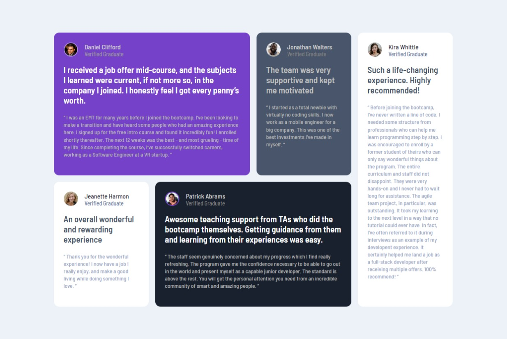
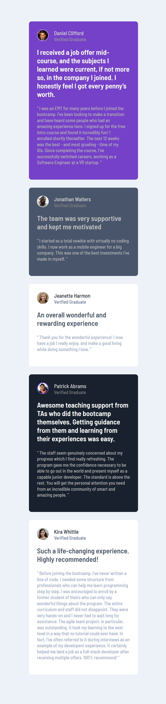

# Frontend Mentor - Testimonials grid section

This is a Solution to the the  [ Testimonials grid section  ](https://www.frontendmentor.io/challenges/testimonials-grid-section-Nnw6J7Un7). Frontend Mentor challenges  helps to improve your coding  skills by building realistic projects.

## Table of contents

- [Designs](#designs)
- [Link](#links)
- [Built With](#built-with)
- [What I learned](#what-i-learned)
- [Author](#author)
- [About](#about)

### Links

- Live Site URL : [ Four card feature section ](https://ajaysinhaorigin.github.io/FrontendMentor--Challange/testimonials-grid-section-main/)

### Designs

  

### Built with

- Semantic HTML5 markup  
- CSS custom properties  
- Grid

### What I learned

- CSS Grid
- CSS Flex
- CSS Media Quary

### Author

- Frontend Mentor  - [@ajaysinhaorigin](https://www.frontendmentor.io/profile/ajaysinhaorigin)

### About

I was started to code just for Fun and now it Becomes my Passion. I am a Frontend Web-developer Working with ReactJS , Javascript , CSS , HTML .